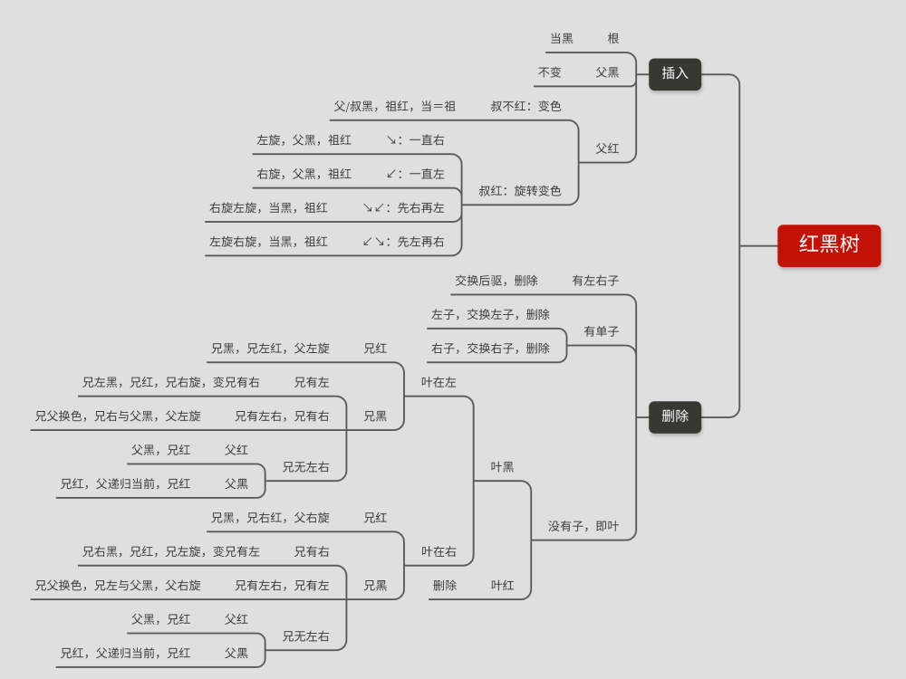

# Data-Structure-C
C语言实现数据结构：链表，AVL树，红黑树

### Linked / Linked-list / 链表
- 输出样例
```cpp
创建链表：1 2 3 4 5 6 7 8 9
反转链表：9 8 7 6 5 4 3 2 1
递归反转链表：1 2 3 4 5 6 7 8 9
反转链表前3个：3 2 1 4 5 6 7 8 9
递归反转链表从2到4：3 4 1 2 5 6 7 8 9
反转链表从2到4：3 2 1 4 5 6 7 8 9
查找链表第1个：找到3
查找链表第一个值为3：找到3，序号是1
插入链表在第1个插入21：21 3 2 1 4 5 6 7 8 9
移除链表第5个：21 3 2 1 5 6 7 8 9
求链表长度：9
插入数组模拟链表：33 21 3 2 1 5 6 7 8 9
循环链表测试：r=9,cycle_r=9,size=10
毁灭链表：已销毁链表
head
```

### Avl / Adelson velsky and landis tree / Avl树
- 输出样例
```cpp
Init from 1 to 9.
3(3)
|------ 2(1)
|   |------ 1(0)
|   ------ (null)
------ 6(2)
    |------ 4(1)
    |   |------ (null)
    |   ------ 5(0)
    ------ 8(1)
        |------ 7(0)
        ------ 9(0)
```


### Rbtree / Red black tree / 红黑树
- 输出样例
```cpp
1 is black, 0 is red.
If the rbtest output is all 1, five characteristics are met.

r b tree init : 1, 2, 3, 4, 5, 6, 7, 8, 9
4(1)
|----- 2(0)
|   |----- 1(1)
|   ------ 3(1)
------ 6(0)
    |----- 5(1)
    ------ 8(1)
        |----- 7(0)
        ------ 9(0)

rbtest : 1 1 1 1
```
- 思维导图
<p></img></p>
